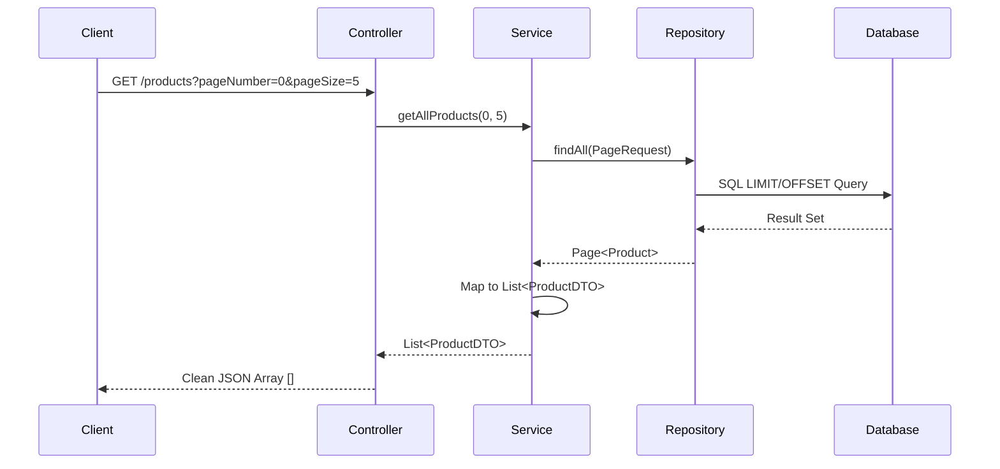

This is the structured content for your `README.md` or a `LECTURE_NOTES.md` file. It covers the advanced data handling techniques discussed today, including the recursion fix and pagination logic.

---

# 🚀 Advanced Data Handling: Recursion & Pagination

This module focuses on optimizing API performance and fixing common relational data issues in Spring Boot.

## 🔄 1. The Recursion Problem & DTO Solution

### **The Issue: Infinite JSON Loops**

When entities have bidirectional relationships (e.g., `Category` ↔ `Product`), the default JSON serializer (Jackson) enters an infinite loop. This results in a `StackOverflowError` as the system tries to serialize the parent, then the child, then the parent again, indefinitely.

### **The Solution: DTO Flattening**

By using **Data Transfer Objects (DTOs)**, we "flatten" the object structure. The `ProductDTO` contains a simple `String categoryName` instead of a full `Category` object, effectively breaking the circular reference.

---

## 📄 2. Pagination & Sorting

To handle large datasets (e.g., thousands of products), we implement **Pagination** to send data in small, manageable chunks.

### **PagingAndSortingRepository**

We utilize the `PagingAndSortingRepository` interface, which extends the standard `JpaRepository` to provide:

* `findAll(Pageable pageable)`: Fetches a specific slice of data.
* `findAll(Sort sort)`: Fetches data in a specific order.

### **SQL Behind the Scenes**

Spring Data JPA translates the `Pageable` object into standard SQL `LIMIT` and `OFFSET` clauses.

* **Page 0, Size 5:** `SELECT * FROM products LIMIT 5 OFFSET 0`
* **Page 1, Size 5:** `SELECT * FROM products LIMIT 5 OFFSET 5`

---

## 🛠️ 3. Implementation Logic

### **Controller Layer**

We use `@RequestParam` to allow the client to specify the page and size dynamically.

```java
@GetMapping("/all")
public ResponseEntity<List<ProductDTO>> getAllProducts(
    @RequestParam(value = "pageNumber", defaultValue = "0", required = false) int pageNumber,
    @RequestParam(value = "pageSize", defaultValue = "5", required = false) int pageSize
) {
    return ResponseEntity.ok(productService.getAllProducts(pageNumber, pageSize));
}

```

### **Service Layer (Extraction & Mapping)**

Since a `Page` object contains complex metadata, we use **Java Streams** to extract the content and map it to a clean `List<DTO>`.

```java
public List<ProductDTO> getAllProducts(int pageNumber, int pageSize) {
    Pageable pageable = PageRequest.of(pageNumber, pageSize);
    Page<Product> productPage = productRepo.findAll(pageable);

    // Extract content and map to DTO to prevent recursion and clean the response
    return productPage.getContent().stream()
        .map(product -> modelMapper.map(product, ProductDTO.class))
        .collect(Collectors.toList());
}

```

---

## 📊 Workflow Visualizations

### **Lecture Flow**


### **Data Processing Flow**



---

### **Key Takeaways**

1. **Zero-Based Indexing:** Page numbers in Spring Data JPA start at `0`.
2. **Metadata vs. Content:** Use `page.getContent()` to return a simple list to the frontend.
3. **Data Integrity:** Always validate the existence of a parent entity (Category) before saving a child entity (Product).

---

**Would you like me to add a troubleshooting section for common "Pagination Errors" like `PropertyReferenceException`?**
