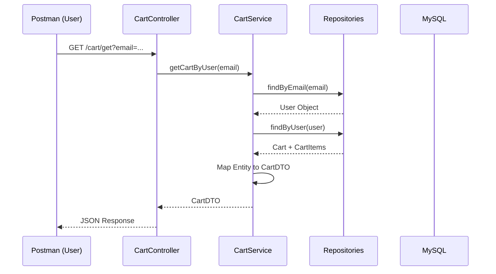

This is the structured content for your `CART_AND_ARCHITECTURE.md` file. It covers the technical implementation of the Cart system and the conceptual shift towards Microservices as discussed in the lecture and seen in commit `7ee18b`.

---

# 🛒 E-Commerce: Cart System & Microservices Transition

This project update introduces a robust Shopping Cart management system and outlines the architectural transition from a Monolith to a Microservices-based system.

## 1. Advanced Cart Logic Implementation

We have implemented a **Bridge Pattern** using a `CartItem` entity to manage the relationship between `User`, `Cart`, and `Product`.

### **Add to Cart Logic**

The service layer follows a strict validation and "Find-or-Create" strategy:

1. **Identity Check:** Verifies user and product existence.
2. **Lazy Cart Initialization:** Uses `orElseGet()` to create a cart only when needed.
3. **Duplicate Detection:** Checks if the product already exists in the cart to update quantity instead of creating a new row.

### **📜 Fetching Cart Details (Code Snippet)**

This logic converts the database entities into a safe DTO format to be consumed by the frontend.

```java
// Service Method to fetch cart by User Email
public CartDTO getCartByUser(String email) {
    // 1. Fetch User or Throw 404
    User user = userRepo.findByEmail(email)
        .orElseThrow(() -> new ResourceNotFoundException("User not found"));

    // 2. Fetch associated Cart
    Cart cart = cartRepo.findByUser(user)
        .orElseThrow(() -> new ResourceNotFoundException("Cart not initialized for user"));

    // 3. Convert to DTO (Breaks recursion and hides sensitive DB fields)
    return modelMapper.map(cart, CartDTO.class);
}

```

---

## 🏗️ 2. Architectural Evolution: Monolith vs. Microservices

### **What is a Monolithic Architecture?**

A Monolith is a single, unified unit. Our current application is a Monolith because the User, Product, Category, and Cart modules all reside in the same codebase, share the same database, and run as a single service.

### **What are Microservices?**

Microservices involve breaking the application into small, independent services (e.g., `User-Service`, `Order-Service`). Each service runs its own process, has its own database, and communicates over the network (usually via REST or Message Queues).

### **Comparison Table**

| Feature | Monolith (Current) | Microservices (Target) |
| --- | --- | --- |
| **Codebase** | Single repository. | Multiple repositories. |
| **Database** | Shared Database. | Database-per-service (Decoupled). |
| **Scaling** | Scale the entire app. | Scale individual services (e.g., scale only 'Cart'). |
| **Reliability** | Single Point of Failure. | Fault Isolation (One service down doesn't kill all). |
| **Communication** | Direct Java Method Calls. | HTTP/REST (using **FeignClient**). |

---

## 📞 3. Inter-Service Communication: FeignClient

In a Microservice environment, services need to talk to each other. We use **Spring Cloud OpenFeign**, which is a declarative REST client.

* **How it works:** Instead of writing complex `RestTemplate` code, you define an interface with annotations.
* **The Workflow:** If the `Order-Service` needs product details, it calls a `ProductClient` interface, and Feign handles the underlying network request.

---

## 📊 Workflow: System Processing

### **How a Cart Request is Handled**



---

### **Key Technical Takeaways**

* **`@Transactional`**: Essential for the Add-to-Cart logic to ensure that if a quantity update fails, the price update is also rolled back.
* **Optional API**: Using `orElseGet` is more performant than `orElse` because the creation logic inside the lambda is only triggered if the value is missing.
* **Decoupling**: DTOs are mandatory when fetching Cart details to prevent Jackson from falling into an infinite recursion loop during JSON serialization.

---

**Would you like me to prepare a "FeignClient Setup Guide" for your next lecture where you start splitting these into separate services?**
