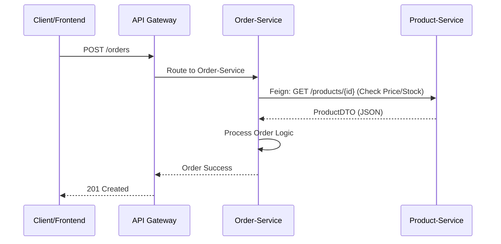

This is the professional-grade Markdown content for your `MICROSERVICES_TRANSITION.md` file. It covers the architectural shift, the technical "Why," and the core communication patterns introduced in the commit `4c3be38`.

---

# 🏗️ Transitioning to Microservices Architecture

This project phase marks the evolution from a **Monolithic** application to a **Distributed System**. We are breaking down business capabilities into independent, scalable services.

## 1. The Monolith Problem Statement

While the initial development was faster, the Monolithic architecture reached a "Scaling Wall":

* **Deployment Coupling:** A small change in `Category` required a full redeploy of the entire application.
* **Resource Inefficiency:** We could not scale the `Product` service independently from the `User` service.
* **Reliability Risk:** A memory leak in the `Cart` logic would crash the entire platform.

---

## 2. Microservice Core Principles

Our transition follows the **Domain-Driven Design (DDD)** approach:

### **A. Service Decomposition**

We are splitting the monolith into specific **Bounded Contexts**:

1. **User-Service:** Manages profiles and authentication.
2. **Product-Service:** Manages categories and catalogs.
3. **Order-Service:** Manages transactions and history.

### **B. Data Sovereignty (Database per Service)**

Each service now owns its data. No service is allowed to access the database of another service directly. This ensures that changes to one service's schema do not break others.

---

## 3. Distributed Communication: OpenFeign

Since services can no longer perform SQL Joins, they must communicate over the network. We utilize **Spring Cloud OpenFeign** for synchronous communication.

### **Why OpenFeign?**

* **Declarative:** It turns REST calls into simple Java Interfaces.
* **Load Balancing:** It integrates with service discovery to balance requests automatically.
* **Abstraction:** Developers can call remote services as if they were local beans.

### **Implementation Concept**

```java
@FeignClient(name = "PRODUCT-SERVICE")
public interface ProductClient {
    @GetMapping("/api/products/{id}")
    ProductDTO getProductById(@PathVariable("id") Long id);
}

```

---

## 🌐 4. The Spring Cloud Ecosystem

To manage a distributed system, we are implementing the following infrastructure components:

| Component | Role | Technology |
| --- | --- | --- |
| **Service Discovery** | The "Yellow Pages" for services. | **Netflix Eureka** |
| **API Gateway** | The unified entry point for all clients. | **Spring Cloud Gateway** |
| **External Configuration** | Centralized `application.yml` management. | **Spring Cloud Config** |
| **Resilience** | Prevents cascading failures. | **Resilience4j (Circuit Breaker)** |

---

## 📉 Architectural Workflow

### **Data Flow in a Distributed Environment**



---

## 🚀 Key Benefits of this Shift

1. **Fault Isolation:** A failure in the `Notification-Service` will not prevent users from placing orders.
2. **Technological Freedom:** Different services can use different Java versions or even different databases (Polyglot Persistence).
3. **Speed of Innovation:** Teams can develop and deploy their specific services without coordinating a global release.

---

**Next Step:** Implementation of the **Eureka Service Registry** to allow dynamic discovery of our newly created microservices.

**Would you like me to create a "Migration Guide" for your code, showing how to move the existing `CartItem` logic into its own standalone service?**
